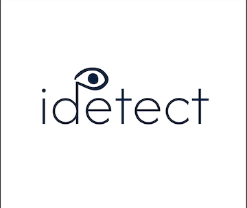

<p align="center">
  
</p>

<h1 align="center">iDetect: Investor Mood Detection for Job Creation</h1>

<p align="center">
  <strong>Facial expression analysis for approachability detection</strong>
</p>

---

## Overview

**iDetect** is a machine learning project that classifies facial expressions as *approachable* or *not approachable*, helping entrepreneurs time investor and partner pitches more effectively. The goal is to support better funding outcomes and, in turn, job creation.

| | |
|---|---|
| **Mission** | Reduce youth unemployment through job creation |
| **Problem** | Pitch timing is critical; approaching when the investor is receptive improves outcomes |
| **Approach** | Binary classification of facial expressions using traditional ML (SVM) and deep learning |

---

## Dataset

This project uses **AffectNet**, a large-scale facial expression dataset.

- **Source:** [AffectNet on Kaggle](https://www.kaggle.com/datasets/mstjebashazida/affectnet)
- **Classes:**  
  - **Approachable (1):** Happy, Neutral  
  - **Not approachable (0):** Angry, Contempt

Download the dataset from the link above and place it in the project directory (or mount it in Google Drive when using Colab).

---

## Project structure

The notebook is organized as follows:

1. **Setup and dependencies** — Libraries, reproducibility, GPU configuration
2. **Google Colab setup** — Drive mounting and paths
3. **Data loading and preprocessing** — Loading AffectNet and train/val/test splits
4. **Traditional ML: SVM** — Five SVM experiments (HOG, LBP, PCA, class weights, combined features)
5. **Deep learning** — Five experiments (EfficientNetB0 transfer learning, fine-tuning, custom CNNs)
6. **Final comparison** — Best model selection and test-set evaluation
7. **Conclusions** — Summary of findings and recommendations

---

## Requirements

- Python 3.x
- NumPy, Pandas
- Matplotlib, Seaborn
- Scikit-learn
- TensorFlow 2.x / Keras
- OpenCV
- tqdm

A GPU is recommended for the deep learning sections; the notebook is set up for **Google Colab** with optional Drive mounting.

---

## Quick start

1. Clone the repository and open the notebook:
   ```bash
   git clone <your-repo-url>
   cd iDetect-Summative-introduction_to_machine_learning
   ```
2. Download [AffectNet from Kaggle](https://www.kaggle.com/datasets/mstjebashazida/affectnet) and place the data (e.g. in an `AffectNet/` folder) or upload to Google Drive.
3. Open `iDetect_Project_Summative_introduction_to_machine_learning.ipynb` in Jupyter or upload to **Google Colab**.
4. In Colab: run the Drive mount cell and set `DATA_DIR` to your dataset path.
5. Run all cells in order (GPU recommended for the DL sections).

---

## Methods at a glance

| Category | Examples |
|----------|----------|
| **Traditional ML** | SVM with RBF kernel; HOG and LBP features; PCA; balanced class weights; combined HOG+LBP |
| **Deep learning** | EfficientNetB0 transfer learning (frozen and fine-tuned), custom CNNs, tf.data pipeline, mixed precision |

---

## License and attribution

- **Dataset:** AffectNet — use and citation should follow the terms and conditions of the dataset source (Kaggle and original AffectNet authors).
- **Code:** See repository license file, if present.

---

<p align="center">
  <sub>iDetect — Introduction to Machine Learning summative project</sub>
</p>
